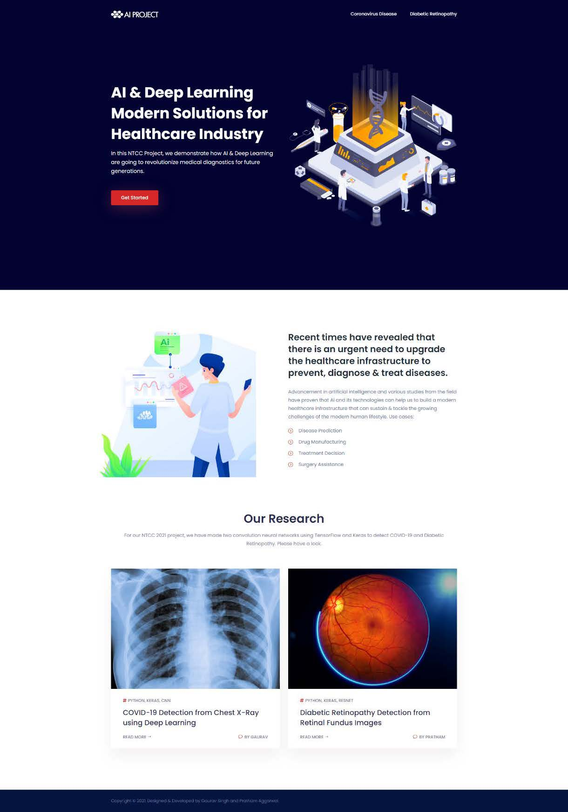
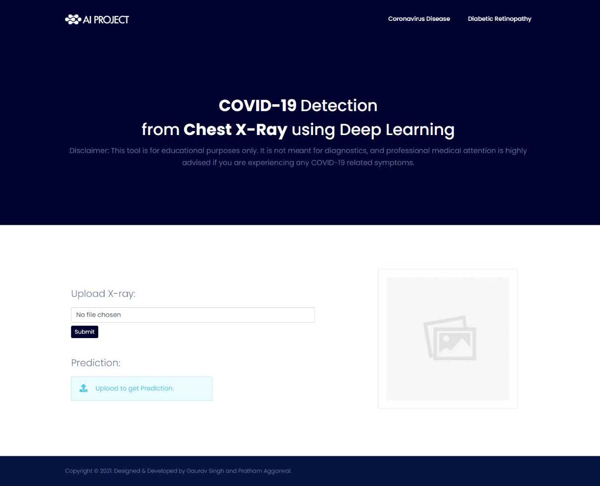
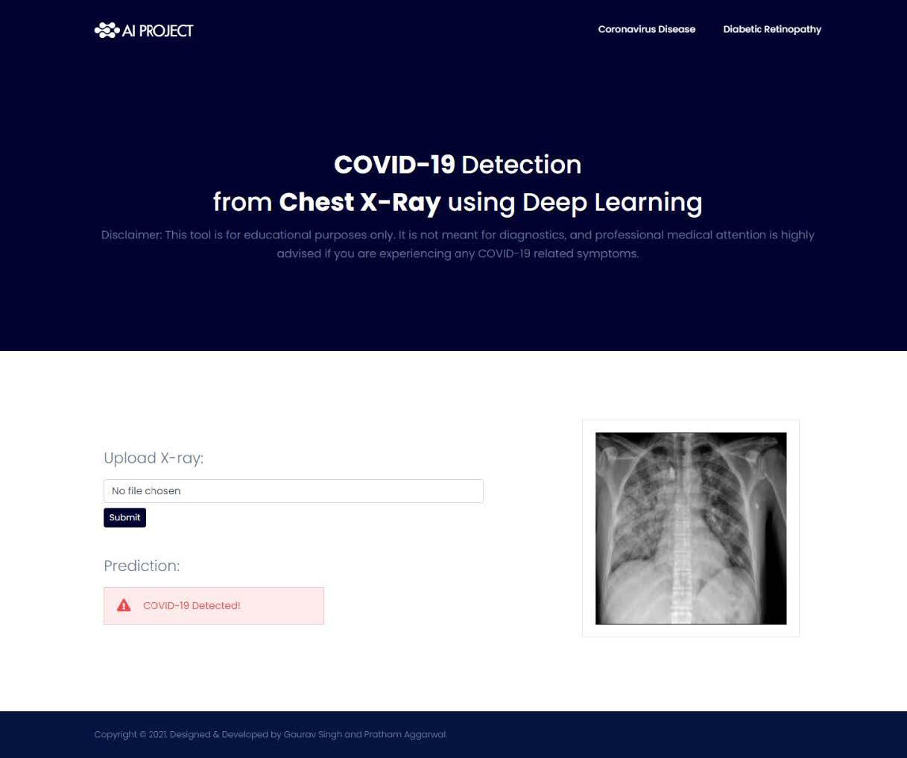
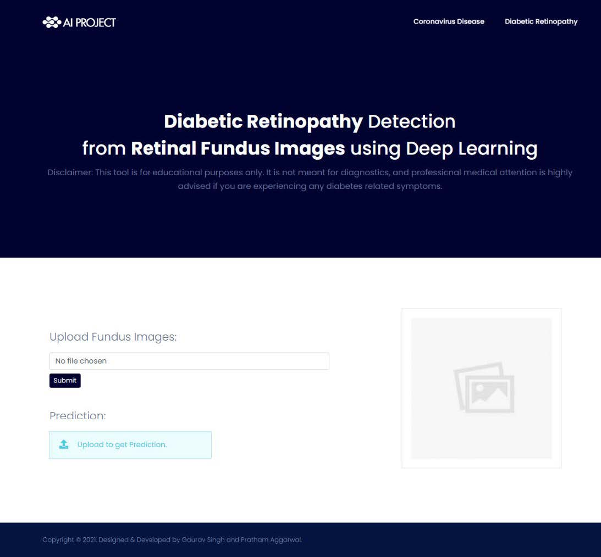
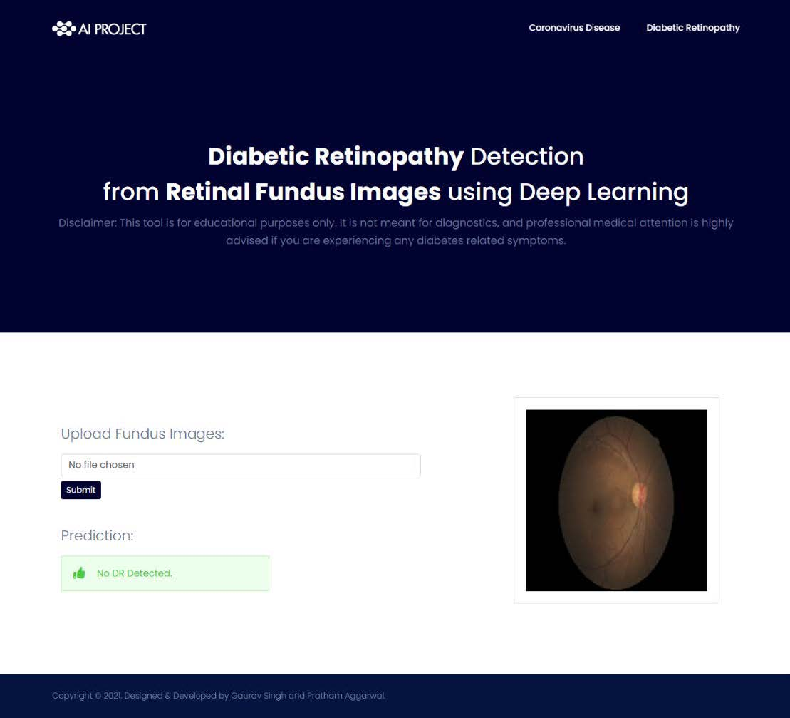

<!-- Improved compatibility of back to top link: See: https://github.com/othneildrew/Best-README-Template/pull/73 -->

<!--
*** Thanks for checking out the Best-README-Template. If you have a suggestion
*** that would make this better, please fork the repo and create a pull request
*** or simply open an issue with the tag "enhancement".
*** Don't forget to give the project a star!
*** Thanks again! Now go create something AMAZING! :D
-->

<!-- PROJECT SHIELDS -->
<!--
*** I'm using markdown "reference style" links for readability.
*** Reference links are enclosed in brackets [ ] instead of parentheses ( ).
*** See the bottom of this document for the declaration of the reference variables
*** for contributors-url, forks-url, etc. This is an optional, concise syntax you may use.
*** https://www.markdownguide.org/basic-syntax/#reference-style-links
-->
[![Contributors][contributors-shield]][contributors-url]
[![Forks][forks-shield]][forks-url]
[![Stargazers][stars-shield]][stars-url]
[![Issues][issues-shield]][issues-url]
[![MIT License][license-shield]][license-url]
[![LinkedIn][linkedin-shield]][linkedin-url]

<!-- PROJECT LOGO -->
 

  

<h3 align="center">Covid-19 and Diabetic Retinopathy Detector</h3>

  

This GitHub repository contains Python code for two deep learning models: one for COVID-19 detection from chest X-rays and another for Diabetic Retinopathy (DR) detection from retinal fundus images. The models are built using Keras API with TensorFlow as the backend, and they were trained in the Google Colab environment. Additionally, a Python-Flask web application is included to deploy the trained models and get predictions on new data. The project aims to provide early detection solutions for these critical medical conditions and offers accessibility through the web application interface.
     
    <a href="https://github.com/knowgaurav/covid-dr-detector">View Demo</a>
    ·
    <a href="https://github.com/knowgaurav/covid-dr-detector/issues">Report Bug</a>
    ·
    <a href="https://github.com/knowgaurav/covid-dr-detector/issues">Request Feature</a>
  

<!-- TABLE OF CONTENTS -->

  
Table of Contents

  <ol>
    <li>
      <a href="#about-the-project">About The Project</a>
      <ul>
        <li><a href="#built-with">Built With</a></li>
      </ul>
    </li>
    <li><a href="#usage">About</a></li>
    <li><a href="#license">License</a></li>
    <li><a href="#contact">Contact</a></li>
    <li><a href="#acknowledgments">Acknowledgments</a></li>
  </ol>

<!-- ABOUT THE PROJECT -->
## About The Project

  

  

  

  

  

(<a href="#readme-top">back to top</a>)

### Built With

* 
* 
* 
* 

(<a href="#readme-top">back to top</a>)

<!-- GETTING STARTED -->
## Details

**COVID-19 and Diabetic Retinopathy Detection with Deep Learning Models**

This GitHub repository houses an innovative and comprehensive project aimed at leveraging the power of deep learning to detect two critical medical conditions: COVID-19 from chest X-rays and Diabetic Retinopathy (DR) from retinal fundus images. The repository contains Python code that implements two separate deep learning models using the Keras API with TensorFlow as the backend, along with a Python-Flask web application for deploying and obtaining predictions on new data.

**Project Overview:**

1. **COVID-19 Detection Model:** The first deep learning model is designed to detect COVID-19 from chest X-ray images. The model architecture is carefully crafted to identify specific patterns and features associated with the disease, enabling it to provide accurate predictions.

2. **Diabetic Retinopathy Detection Model:** The second deep learning model focuses on Diabetic Retinopathy detection using retinal fundus images. With a carefully curated dataset, this model can classify different stages of DR, allowing for early intervention and effective management of the condition.

**Key Features:**

- **Deep Learning and Keras:** Both models are built using deep learning techniques, taking advantage of Keras API, a user-friendly and powerful high-level neural networks API that simplifies the process of building complex models.

- **TensorFlow Backend:** TensorFlow, a leading open-source deep learning framework, serves as the backend for the Keras models, ensuring efficient computation and scalability.

- **Google Colab Environment:** The development and training of the models are performed in Google Colab, a cloud-based Jupyter notebook environment. This choice provides access to powerful hardware resources, including GPUs or TPUs, facilitating faster training and experimentation.

- **Python-Flask Web Application:** To make these models accessible and usable by a broader audience, the project includes a web application built using the Python-Flask framework. Users can upload chest X-rays or retinal fundus images to the application and obtain real-time predictions from the corresponding models.

**Benefits:**

- **Early Detection and Intervention:** The deep learning models developed in this project can potentially assist healthcare professionals in early detection of COVID-19 and Diabetic Retinopathy. Timely detection can lead to better patient outcomes and more effective disease management.

- **Accessibility:** By deploying the models through a web application, individuals and medical practitioners can easily access the system from any device with an internet connection, making it a valuable tool for remote diagnosis and consultations.

- **Continued Improvement:** As an open-source project, the GitHub repository encourages collaboration and contributions from the community. Researchers and developers can participate in enhancing the models, expanding the datasets, and improving overall performance.

This GitHub repository serves as a valuable resource for researchers, medical professionals, and developers interested in the application of deep learning for medical image analysis. The combination of COVID-19 and Diabetic Retinopathy detection in one project showcases the versatility and potential impact of cutting-edge AI technologies in the healthcare domain.

(<a href="#readme-top">back to top</a>)

<!-- LICENSE -->
## License

Distributed under the MIT License. See `LICENSE.txt` for more information.

(<a href="#readme-top">back to top</a>)

<!-- CONTACT -->
## Contact

Gaurav Singh - [@knowgaurav01](https://twitter.com/knowgaurav01) - hello@sgaurav.me

Project Link: [https://github.com/knowgaurav/covid-dr-detector](https://github.com/github_username/interview-prep)

(<a href="#readme-top">back to top</a>)

<!-- ACKNOWLEDGMENTS -->
## Acknowledgments

* [Covid-19 & Diabetic Retinopathy (DR) Detection using AI & Deep Learning
](https://ieeexplore.ieee.org/document/9990336)

(<a href="#readme-top">back to top</a>)

<!-- MARKDOWN LINKS & IMAGES -->
<!-- https://www.markdownguide.org/basic-syntax/#reference-style-links -->
[contributors-shield]: https://img.shields.io/github/contributors/knowgaurav/covid-dr-detector.svg?style=for-the-badge
[contributors-url]: https://github.com/knowgaurav/covid-dr-detector/graphs/contributors
[forks-shield]: https://img.shields.io/github/forks/knowgaurav/covid-dr-detector.svg?style=for-the-badge
[forks-url]: https://github.com/knowgaurav/covid-dr-detector/network/members
[stars-shield]: https://img.shields.io/github/stars/knowgaurav/covid-dr-detector.svg?style=for-the-badge
[stars-url]: https://github.com/knowgaurav/covid-dr-detector/stargazers
[issues-shield]: https://img.shields.io/github/issues/knowgaurav/covid-dr-detector.svg?style=for-the-badge
[issues-url]: https://github.com/knowgaurav/covid-dr-detector/issues
[license-shield]: https://img.shields.io/github/license/knowgaurav/covid-dr-detector.svg?style=for-the-badge
[license-url]: https://github.com/knowgaurav/covid-dr-detector/blob/master/LICENSE.txt
[linkedin-shield]: https://img.shields.io/badge/-LinkedIn-black.svg?style=for-the-badge&logo=linkedin&colorB=555
[linkedin-url]: https://in.linkedin.com/in/knowgaurav
[product-screenshot]: images/screenshot.png
[Next.js]: https://img.shields.io/badge/next.js-000000?style=for-the-badge&logo=nextdotjs&logoColor=white
[Next-url]: https://nextjs.org/
[React.js]: https://img.shields.io/badge/React-20232A?style=for-the-badge&logo=react&logoColor=61DAFB
[React-url]: https://reactjs.org/
[Vue.js]: https://img.shields.io/badge/Vue.js-35495E?style=for-the-badge&logo=vuedotjs&logoColor=4FC08D
[Vue-url]: https://vuejs.org/
[Angular.io]: https://img.shields.io/badge/Angular-DD0031?style=for-the-badge&logo=angular&logoColor=white
[Angular-url]: https://angular.io/
[Svelte.dev]: https://img.shields.io/badge/Svelte-4A4A55?style=for-the-badge&logo=svelte&logoColor=FF3E00
[Svelte-url]: https://svelte.dev/
[Laravel.com]: https://img.shields.io/badge/Laravel-FF2D20?style=for-the-badge&logo=laravel&logoColor=white
[Laravel-url]: https://laravel.com
[Bootstrap.com]: https://img.shields.io/badge/Bootstrap-563D7C?style=for-the-badge&logo=bootstrap&logoColor=white
[Bootstrap-url]: https://getbootstrap.com
[JQuery.com]: https://img.shields.io/badge/jQuery-0769AD?style=for-the-badge&logo=jquery&logoColor=white
[JQuery-url]: https://jquery.com 
[C++]: https://img.shields.io/badge/c++-%2300599C.svg?style=for-the-badge&logo=c%2B%2B&logoColor=white
[C++-url]: https://isocpp.org/
[Codeforces]: https://img.shields.io/badge/Codeforces-445f9d?style=for-the-badge&logo=Codeforces&logoColor=white
[Codeforces-url]: https://codeforces.com/
[LeetCode]: https://img.shields.io/badge/LeetCode-000000?style=for-the-badge&logo=LeetCode&logoColor=#d16c06
[LeetCode-url]: https://leetcode.com